# Who Should the Bank Call?
### A data story: predicting term-deposit subscriptions for a Portuguese bank's telemarketing campaigns (May 2008 – Nov 2010)

<p align="center">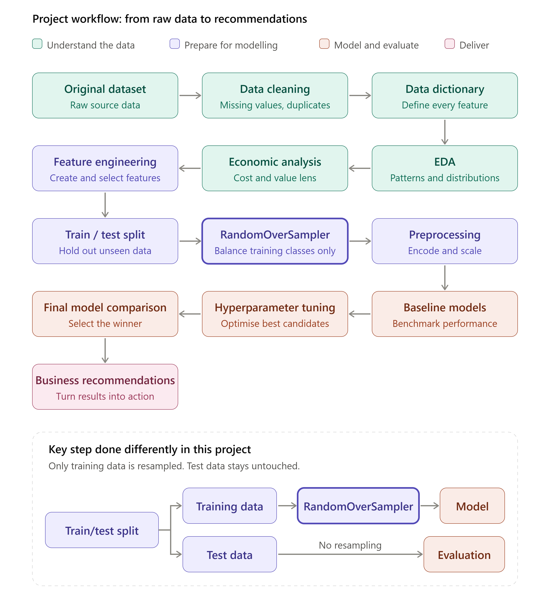</p>

> **The question:** only **11.3%** of customers subscribed to a term deposit. Can we find the customers worth calling first?

**The story in five lines**
1. A customer who said yes before says yes again: **65.1%** vs 8.8% with no history.
2. Mobile beats landline (**14.7% vs 5.2%**), and returns fall with every repeat call (13.0% on call 1, 3.1% beyond ten).
3. Customers subscribed when interest rates were low (median Euribor **1.27% vs 4.86%**).
4. A model ranks customers about **4× better than random calling**, but it leans on the economic period, so it must be retrained each wave.
5. Plan: call warm customers first, rank the rest by score, cap repeat calls, lead with mobile.

**Chapters:** [1 Data](#chapter-1--the-data-what-do-we-have) · [2 Customers](#chapter-2--the-customers-only-11-say-yes) · [3 Drivers](#chapter-3--the-drivers-who-subscribes-and-when-does-calling-stop-paying-off) · [4 Context](#chapter-4--the-context-timing-and-the-economy) · [5 Segments](#chapter-5--coverage-and-segments-three-kinds-of-customer) · [6 Model](#chapter-6--the-model-can-we-rank-customers-before-the-call) · [7 Plan](#chapter-7--the-plan-what-the-marketing-team-should-do-next)

---

## Chapter 1 · The data: what do we have?

41,188 campaign records with customer profile, contact history and five economic indicators. After removing **12 duplicates** the file has **41,176 rows**, with no missing cells. `unknown` is kept as its own category rather than guessed.

**So what:** the data is clean enough to model. Two things must shape the design: the class imbalance and the overlapping economic columns.

---

## Chapter 2 · The customers: only 11% say yes

<table><tr>
<td width="46%" valign="top">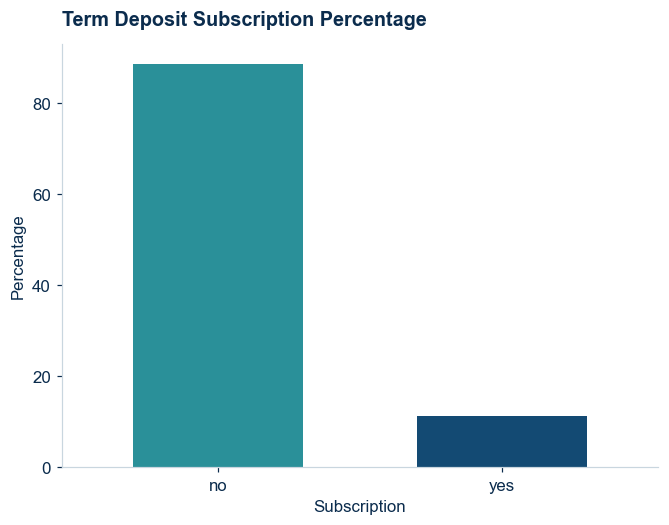<br><b>88.7% said no, 11.3% said yes.</b></td>
<td width="54%" valign="top">

A model that predicts "no" for everyone would score <b>88.7% accuracy</b> and find <b>zero</b> subscribers. So models are judged on precision, recall and PR-AUC, not accuracy.

<b>So what:</b> the class imbalance is the first thing the model design must respect.

</td></tr></table>

<details><summary><b>Behind the scenes: the economic columns overlap</b></summary>

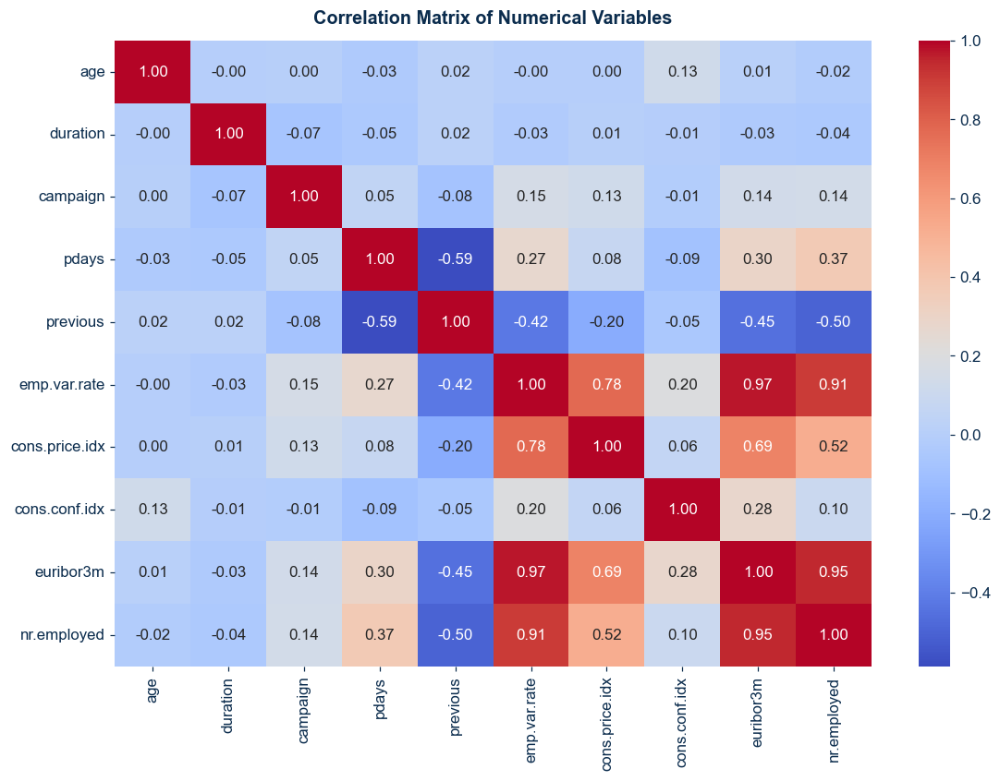<br>
Employment variation, Euribor and number employed are almost the same signal (correlations of 0.91–0.97).
</details>

---

## Chapter 3 · The drivers: who subscribes, and when does calling stop paying off?

### Past success is the strongest signal, and mobile is the best channel

<table><tr>
<td width="50%" valign="top">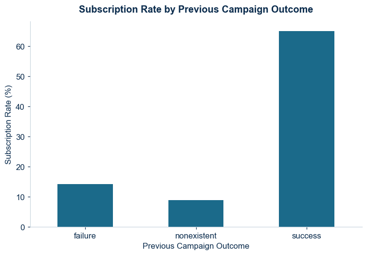<br><b>65.1% of previous successes subscribed again</b> vs 14.2% after a failure and 8.8% with no history.</td>
<td width="50%" valign="top">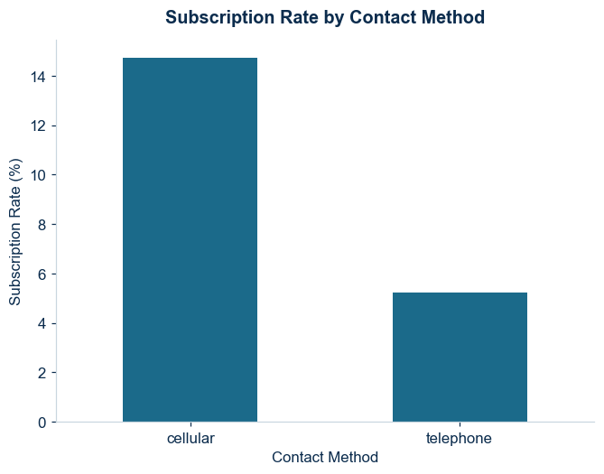<br><b>Cellular converts 14.7%</b> vs 5.2% on landline, almost three times better.</td>
</tr></table>

### Repeated calls stop paying off

<table><tr>
<td width="55%" valign="top">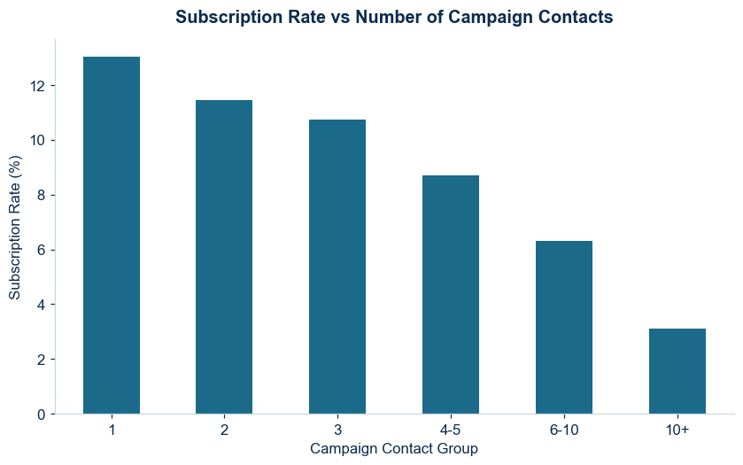</td>
<td width="45%" valign="top">

The rate falls from <b>13.0%</b> on the first call to <b>3.1%</b> beyond ten. From the third contact (10.7%) it drops below the 11.3% campaign average.

<b>So what:</b> cap repeat calls and spend them on new customers instead.

</td></tr></table>

### Who responds: occupation, age and education

<table><tr>
<td width="50%" valign="top">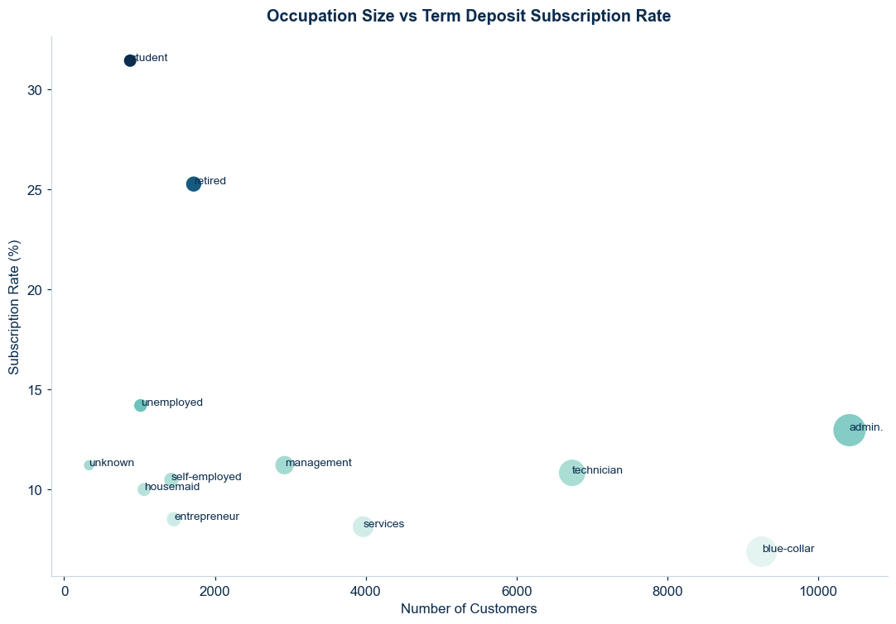<br><b>Students and retirees convert most, but they are small groups</b> (875 students vs 9,253 blue-collar workers).</td>
<td width="50%" valign="top">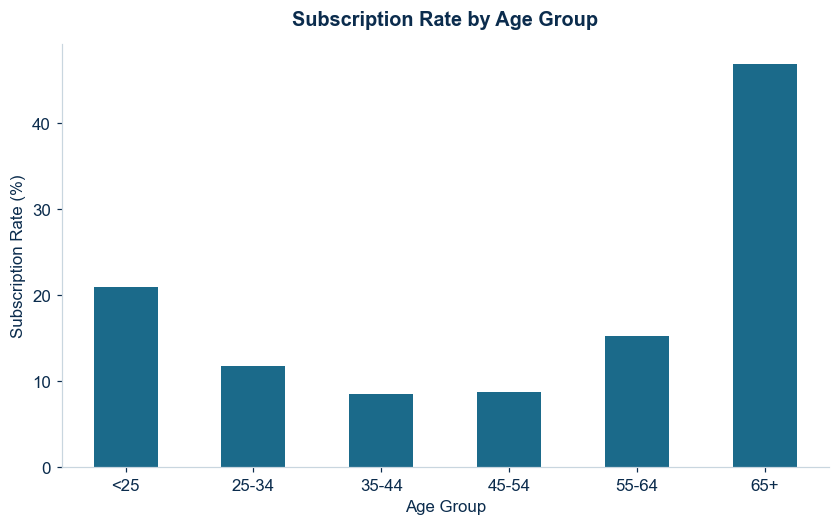<br><b>A U-shape:</b> 21.0% under 25 and 46.9% over 65, vs about 8.5% for ages 35–54.</td>
</tr></table>

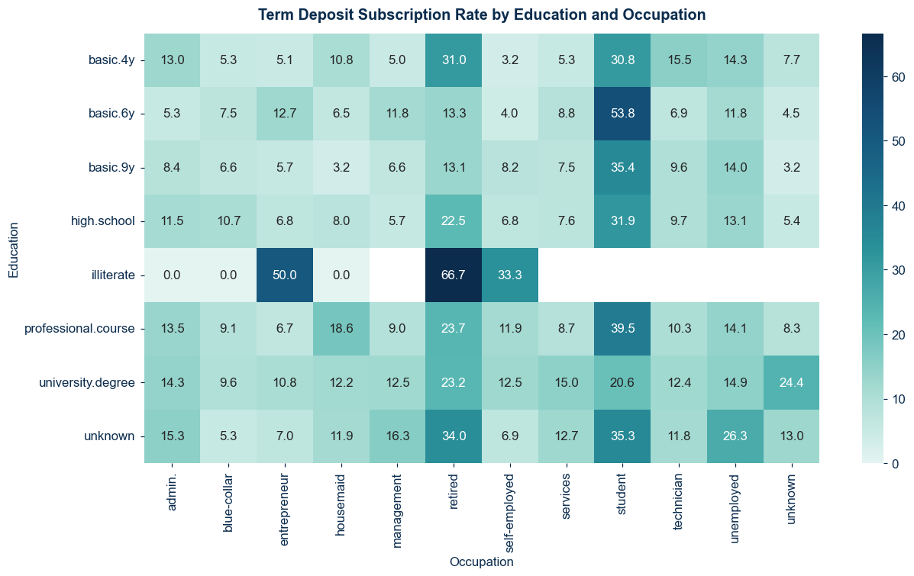<br>
**University graduates convert at 13.7%** vs 7.8% for basic 9-year education, but **occupation matters more**: students convert at roughly 21–54% and blue-collar workers at 5–11% across education levels.

<details><summary><b>Behind the scenes: call duration is excluded from the model</b></summary>

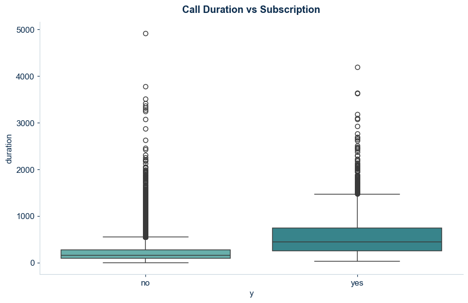<br>
Subscribers talked for a median of 449 seconds vs 164, but duration is only known after the call, so using it would be cheating.
</details>

**So what:** past success, mobile contact, students, retirees, over-65s and early attempts all point to the same warm-prospect profile. Repeated calls and landline contact point away from it.

---

## Chapter 4 · The context: timing and the economy

<table><tr>
<td width="58%" valign="top">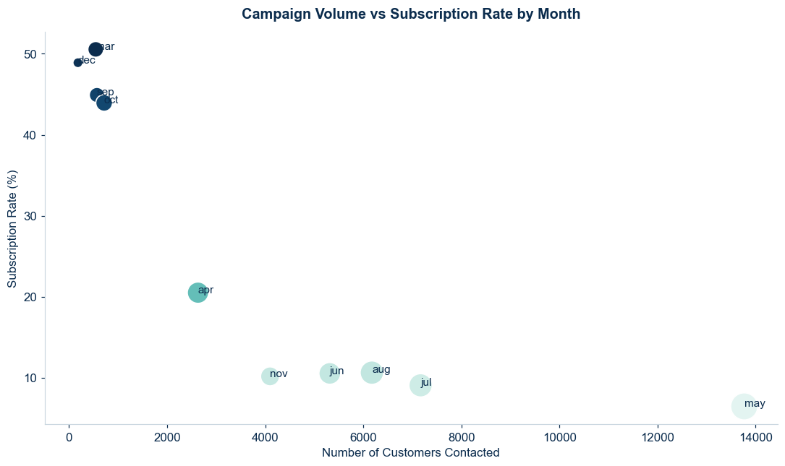</td>
<td width="42%" valign="top">

<b>March, September, October and December convert at 44–51%</b>, but received only <b>4.9% of calls</b> and produced <b>20.2% of subscriptions</b>. May took <b>33.4% of calls</b> and converted 6.4%.

Those high months also coincide with very low Euribor, so month and economy are mixed together.

</td></tr></table>

**Subscribers were contacted in a different economy:** median Euribor 1.27% vs 4.86%. The subscription rate was **24% when Euribor was at or below 1.5** and about **5% above 3**.

<details><summary><b>Behind the scenes: the five economic indicators, by outcome</b></summary>

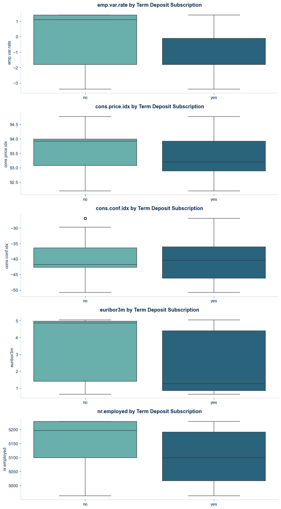
</details>

**So what:** "call in the good months" is not the lesson. Term deposits sell better when interest rates are low, and a high-converting month with few contacts is a test opportunity, not proof.

---

## Chapter 5 · Coverage and segments: three kinds of customer

<table><tr>
<td width="42%" valign="top">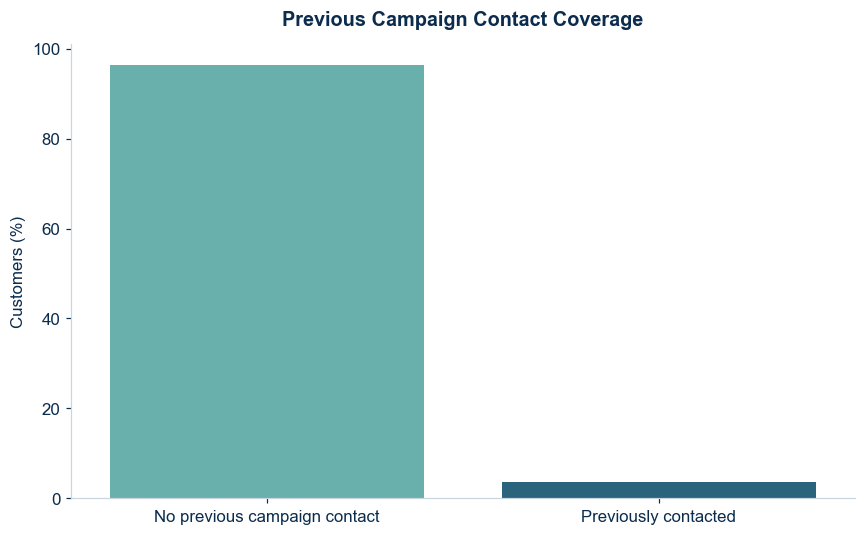<br><b>96.3% of customers had no previous campaign contact.</b></td>
<td width="58%" valign="top">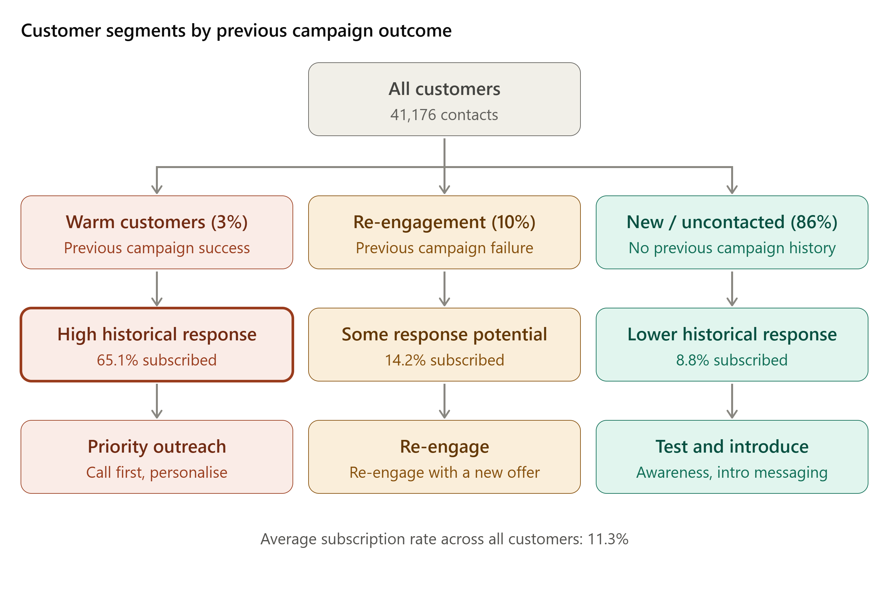<br><b>Three segments, three treatments.</b></td>
</tr></table>

| Segment | Share of list | Response | Share of all subscribers |
|---|---|---|---|
| **Warm** (previous success) | 3.3% | 65.1% | 19.3% |
| **Re-engage** (previous failure) | 10.3% | 14.2% | 13.0% |
| **New** (no history) | 86.3% | 8.8% | 67.7% |

**So what:** warm customers deserve priority, but most subscribers still come from the new group, so that group needs smart targeting, not exclusion. That is the job of the model.

---

## Chapter 6 · The model: can we rank customers before the call?

**Design choices from the EDA:** `duration` excluded; `pdays = 999` turned into a `previously_contacted` flag; oversampling inside the **training pipeline only**, so the test set keeps the real 11.3% rate.

<table><tr>
<td width="50%" valign="top">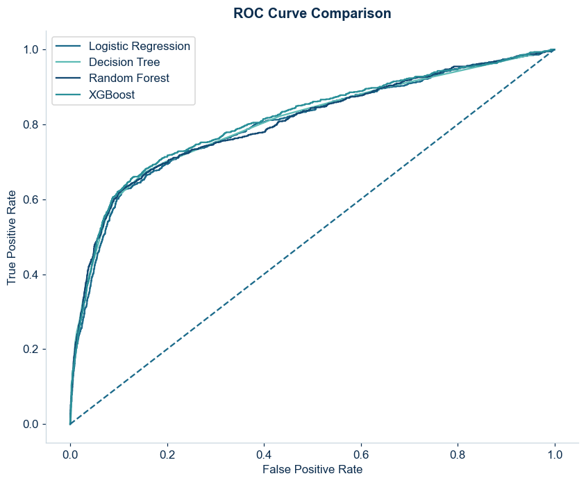<br><b>ROC curves: all four models overlap.</b></td>
<td width="50%" valign="top">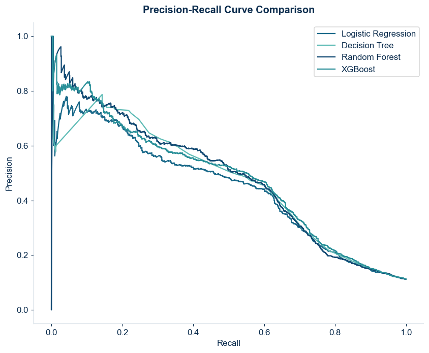<br><b>Precision-recall: a near tie.</b></td>
</tr></table>

| Model (held-out test set) | Precision | Recall | F1 | ROC-AUC | PR-AUC |
|---|---|---|---|---|---|
| Logistic Regression | 0.448 | 0.577 | 0.504 | 0.800 | 0.446 |
| Decision Tree | 0.464 | 0.580 | 0.516 | 0.805 | 0.461 |
| **Random Forest (final)** | **0.495** | 0.545 | 0.519 | 0.804 | 0.483 |
| XGBoost | 0.477 | 0.580 | 0.523 | 0.812 | 0.479 |
| Tuned XGBoost | 0.477 | 0.592 | 0.528 | 0.811 | 0.484 |

The algorithm barely matters; the signal in the data does. **Random Forest** is the final model because it has the highest precision, so the fewest wasted calls. Tuned XGBoost suits cheap channels (SMS, email) where missing a subscriber costs more.

<table><tr>
<td width="42%" valign="top">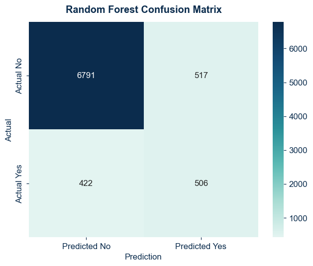<br><b>Finds 506 of 928 subscribers.</b> Of 1,023 customers flagged, 49.5% subscribe vs 11.3% at random.</td>
<td width="58%" valign="top">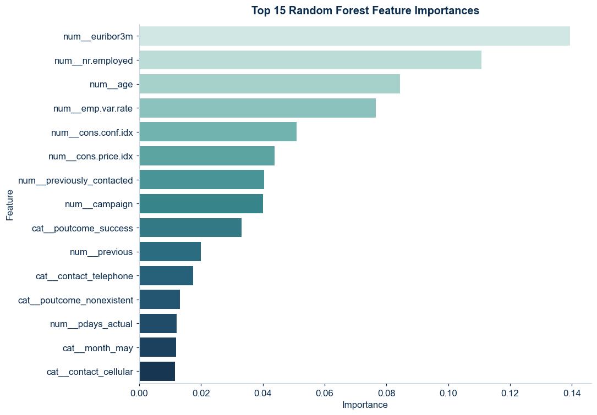<br><b>The economic climate dominates:</b> euribor3m and nr.employed lead.</td>
</tr></table>

**From scores to a call list:** the top decile of scored customers converts at **54.2%** and holds **48.2%** of all subscribers; the top two deciles hold **65.4%**.

**So what:** scores should rank customers, not be read as certainties. The model misses about 4 in 10 subscribers and relies on the economic period, so retrain it every campaign wave.

---

## Chapter 7 · The plan: what the marketing team should do next

| Do this | Because |
|---|---|
| **Call warm customers first**, personalise using their history | 65.1% response |
| **Re-engage** past failures with a new offer and softer follow-up | 14.2% response |
| **Rank new customers with the model**; test low-cost intro messages | 67.7% of subscribers live here |
| **Work down the score** instead of calling the whole list | top 20% holds 65% of subscribers |
| **Cap repeat calls** | below the 11.3% average from the third contact |
| **Mobile first** | 14.7% vs 5.2% |
| **Match the message to the climate**: safety, guaranteed return, clear lock-in | deposits sold best when rates were low |
| **Retrain every campaign wave** | the model leans on economic indicators |

### Limitations
Random split rather than a time split (results may look better than on a future wave) · economic indicators partly stand in for the campaign period · observational data shows association, not cause · scores rank customers, they are not exact probabilities.

---

## Explore the project

| | |
|---|---|
| 📓 [Full notebook](Portugese_Bank_marketing_Insights_and_strategy.ipynb) | Every chart, table and model in the story above |
| 📊 [Presentation](presentation/Bank_Marketing_Presentation.pptx) | 11-slide stakeholder summary |

```bash
git clone https://github.com/PriscillaKanaparthi/Bank-Marketing-Campaign-Analysis.git
cd <repo-name> && pip install -r requirements.txt
jupyter notebook Portugese_Bank_marketing_Insights_and_strategy.ipynb
```

**Tools:** Python · Pandas · Matplotlib · Seaborn · scikit-learn · imbalanced-learn · XGBoost
**Data:** Moro, Cortez & Rita (2014), *A Data-Driven Approach to Predict the Success of Bank Telemarketing*, UCI Machine Learning Repository, "Bank Marketing".
**Author:** [Your name] · [LinkedIn link] · [Email]
